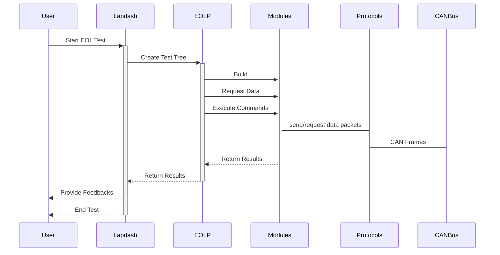

# EOLP - The End Of Line Testing Dependency Processor

EOL is the common acronym for the final test in a automotive production.

Under ideal conditions this test would be just a simple checklist, where the top level systems would be checked one after the other.

But in reality this does not work, because whenever a top level system fails because of any error, it has to be looked deeper and deeper into the subsystems until the error is identified and removed.

So in real live such a EOL test is an up and down dive into the different subsystem and a permanent change between testing and repairs.

All this requires from the operator not only a deep understanding of all systems and their relations between each other, it is also changing on each vehicle because of their different feature content.

The EOLProcessor tries to join these two worlds testing and repair into a single seamless workflow to give the operator a clear way to go.

## The Structure of EOLP

The EOLP consists of a few layers of components (or programmably spoken objects), which are sometimes shared from other programs (e.g. the protocols) or shared with others (e.g. the modules, where modules are not python modules this time, the automotive Electronic Control Units (ECUs) are meant instead).

Because a test system mostly contains also some company internal data, Labdash supports this by loading most of the components from more as only one component directory, so by adding more directories to the configuration files, both public and internal components can be combined as needed.

These different layers are:
* the protocols (like UDS, j1379, CANOpen): They connect to the physical bus and support higher level data communication, if not raw data
* the modules: They represent the different ECUs and using the protocols to bring down their generic functions (read input, serial numbers, flash etc.) into real physical data exchange

These layers are used by the normal Labdash testing scripts, by the EOLP automated processes, but also by other exernal programs as communication interface to the can bus.

